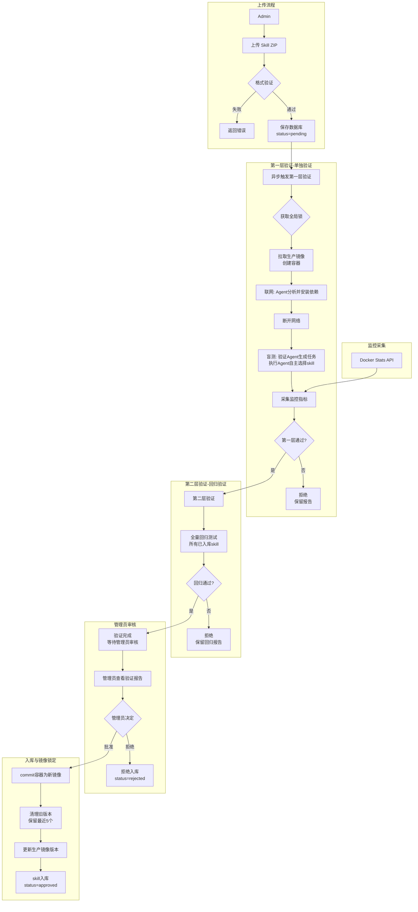

# 技术方案

> v0.1.9 Skill 验证与管理

---

## 零、复用现有代码（避免造轮子）

### 0.1 业界规范兼容

本方案兼容 [agentskills.io](https://agentskills.io/specification) 开放标准，确保 Skill 可移植性。

### 0.2 可复用的现有代码

| 模块 | 现有代码/库 | 复用方式 | 文件 |
|------|------------|----------|------|
| **Docker 容器管理** | `DockerSandboxBackend` | 扩展添加网络控制方法 | `src/docker_sandbox.py` |
| **Agent 创建** | `create_deep_agent` | 直接复用创建验证/执行 Agent | `src/agent_manager.py` |
| **Skill 格式验证** | `deepagents.middleware.skills` | 复用 `_parse_skill_metadata` | DeepAgents 库 |

**说明**：DeepAgents 在加载 skill 时会自动解析 YAML frontmatter，验证 name/description 等字段。我们直接复用其验证逻辑，无需自己实现。

### 0.3 需要新增的代码

| 模块 | 新增原因 | 文件 |
|------|----------|------|
| **Skill 管理器** | Skill CRUD + 状态流转 | `src/skill_manager.py` |
| **验证编排器** | 两层验证流程 + 全局锁 | `src/skill_agent_validator.py` |
| **镜像版本管理** | skill 专用版本控制 | `src/skill_image_manager.py` |
| **监控采集器** | CPU/内存/IO 采集 | `src/skill_metrics.py` |
| **报告生成子 Agent** | 生成 Markdown 验证报告 | `src/skill_agent_validator.py` |
| **Admin API** | 管理接口 | `api/admin.py` |

### 0.4 格式验证（复用 DeepAgents）

DeepAgents 在加载 skill 时会自动进行格式验证（见 `deepagents/middleware/skills.py`）：

| 验证项 | 失败时行为 |
|--------|------------|
| 文件大小 > 10MB | 静默跳过 + warning 日志 |
| YAML frontmatter 格式错误 | 静默跳过 + warning 日志 |
| 缺少 name/description | 静默跳过 + warning 日志 |
| name 格式不规范 | 继续加载 + warning 日志 |
| description 超长 | 截断后加载 + warning 日志 |

**上传时验证**：由于 DeepAgents 的验证是"软验证"（静默跳过），我们需要在上传时主动验证，给用户明确反馈：

```python
from deepagents.middleware.skills import _parse_skill_metadata

def validate_skill_format(skill_path: str) -> tuple[bool, list[str], list[str]]:
    """复用 DeepAgents 的验证逻辑"""
    skill_md_path = os.path.join(skill_path, "SKILL.md")
    
    # 1. 检查 SKILL.md 存在
    if not os.path.exists(skill_md_path):
        return False, ["Missing SKILL.md"], []
    
    # 2. 读取内容
    with open(skill_md_path, encoding='utf-8') as f:
        content = f.read()
    
    # 3. 复用 DeepAgents 的解析逻辑
    directory_name = os.path.basename(skill_path)
    metadata = _parse_skill_metadata(content, skill_md_path, directory_name)
    
    if metadata is None:
        return False, ["Invalid frontmatter format or missing name/description"], []
    
    return True, [], []
```

### 0.5 DockerSandboxBackend 扩展

```python
# src/docker_sandbox.py - 扩展现有类
class DockerSandboxBackend(BaseSandbox):
    # ... 现有代码保持不变 ...
    
    def disconnect_network(self) -> bool:
        """断开容器网络（用于离线验证）"""
        if not self._container:
            return False
        try:
            self._container.reload()
            self.client.networks.get("bridge").disconnect(self._container)
            print(f"[DockerSandbox] Disconnected network for {self.user_id}")
            return True
        except Exception as e:
            print(f"[DockerSandbox] Failed to disconnect: {e}")
            return False
    
    def reconnect_network(self) -> bool:
        """重新连接网络"""
        if not self._container:
            return False
        try:
            self.client.networks.get("bridge").connect(self._container)
            return True
        except Exception as e:
            print(f"[DockerSandbox] Failed to reconnect: {e}")
            return False
```

### 0.6 Agent 创建（复用现有代码）

```python
# src/skill_agent_validator.py - 复用现有 AgentManager
from deepagents import create_deep_agent
from src.config import big_llm
from src.docker_sandbox import DockerSandboxBackend

class ValidationAgents:
    """验证 Agent 管理器（复用现有 create_deep_agent）"""
    
    def __init__(self, container: DockerSandboxBackend):
        self.container = container
        
        # 复用现有框架创建验证 Agent
        self.validation_agent = create_deep_agent(
            model=big_llm,
            backend=lambda _: container,
            system_prompt="""你是 Skill 验证专家。
            任务：
            1. 分析 SKILL.md 内容
            2. 生成 3 个测试任务（不提及 skill 名称）
            3. 评估执行结果并生成报告""",
        )
        
        # 复用现有框架创建执行 Agent
        self.execution_agent = create_deep_agent(
            model=big_llm,
            backend=lambda _: container,
            system_prompt="""你是 Skill 执行者。
            你可以访问 /skills/ 目录下的所有已入库 skill。
            根据任务需求自主选择合适的 skill 执行。""",
        )
```

---

## 一、整体架构

### 1.1 架构图



### 1.2 模块职责

| 模块 | 文件 | 职责 |
|------|------|------|
| Admin API | `api/admin.py` | 管理员接口路由 |
| Skill Manager | `src/skill_manager.py` | Skill CRUD、状态流转、文件操作 |
| Skill Validator | `src/skill_validator.py` | 格式验证、依赖检查、安全扫描 |
| Skill Agent Validator | `src/skill_agent_validator.py` | **双 Agent 两层验证**、全局锁、报告生成 |
| Skill Metrics | `src/skill_metrics.py` | 执行监控采集（CPU/内存/IO/时间） |
| Skill Image Manager | `src/skill_image_manager.py` | **增量镜像管理**、版本控制、清理旧版本 |

---

## 二、核心流程

### 2.1 上传流程

```
管理员上传 zip
       │
       ▼
┌─────────────────────────────────┐
│ 1. 验证管理员权限                 │
│    check_admin(user)            │
└────────────────┬────────────────┘
                 │
                 ▼
┌─────────────────────────────────┐
│ 2. 解压到临时目录                 │
│    skills_pending/{skill_name}/ │
└────────────────┬────────────────┘
                 │
                 ▼
┌─────────────────────────────────┐
│ 3. 格式验证（同步）              │
│    - SKILL.md 存在              │
│    - frontmatter 合法           │
│    - name/description 格式      │
└────────────────┬────────────────┘
                 │
         ┌───────┴───────┐
         │ 格式错误        │ 格式正确
         ▼               ▼
┌─────────────────┐ ┌─────────────────┐
│ 返回错误        │ │ 创建数据库记录   │
│ (不保存文件)    │ │ status=pending  │
└─────────────────┘ │ layer1_passed   │
                    │ layer2_passed   │
                    └────────┬────────┘
                             │
                             ▼
                    ┌─────────────────┐
                    │ 4. 异步触发     │
                    │ 第一层验证      │
                    └────────┬────────┘
                             │
                             ▼
                    ┌─────────────────┐
                    │ 返回上传成功    │
                    │ skill_id        │
                    └─────────────────┘
```

### 2.2 第一层验证：单独验证

```
异步验证任务启动
       │
       ▼
┌─────────────────────────────────┐
│ 1. 获取全局锁                    │
│    同时只验证一个 skill          │
└────────────────┬────────────────┘
                 │
                 ▼
┌─────────────────────────────────┐
│ 2. 更新状态                      │
│    status=validating            │
│    validation_stage=layer1      │
└────────────────┬────────────────┘
                 │
                 ▼
┌─────────────────────────────────┐
│ 3. 拉取当前生产镜像              │
│    skill-runtime:v{current}     │
└────────────────┬────────────────┘
                 │
                 ▼
┌─────────────────────────────────┐
│ 4. 创建验证容器（网络正常）       │
│    - 挂载: /skills/ (ro)        │
│    - 挂载: /skill_under_test/ (ro)│
│    - 挂载: /workspace/ (rw)     │
└────────────────┬────────────────┘
                 │
                 ▼
┌─────────────────────────────────┐
│ 5. 验证 Agent 读取 SKILL.md     │
└────────────────┬────────────────┘
                 │
                 ▼
┌─────────────────────────────────┐
│ 6. 验证 Agent 生成 3 个测试任务   │
│    (不告知应该用哪个 skill)       │
└────────────────┬────────────────┘
                  │
                  ▼
┌─────────────────────────────────────────────────────────────────┐
│ 7. 【阶段1】联网环境验证                                          │
│ ─────────────────────────────────────────────────────────────── │
│                                                                 │
│ a) 执行 Agent 自主安装依赖：                                     │
│    - pip install pandas numpy                                   │
│    - 下载必要的数据文件                                          │
│                                                                 │
│ b) 联网盲测：执行 Agent 执行盲测任务（可使用网络）                │
│                                                                 │
│ c) 记录已安装的依赖列表                                          │
│                                                                 │
│ d) 联网盲测通过？                                                │
│    - 否 → 返回验证失败报告                                       │
│    - 是 → 继续进入阶段2                                          │
│                                                                 │
└─────────────────────────────────────────────────────────────────┘
                  │
                  ▼ 联网盲测通过
┌─────────────────────────────────┐
│ 8. 【阶段2】断开网络              │
│    docker network disconnect    │
└────────────────┬────────────────┘
                  │
                  ▼
┌─────────────────────────────────┐
│ 9. 【阶段3】离线盲测              │
│    执行 Agent 执行盲测任务       │
│    (此时网络已禁用)              │
│    - 可用所有已入库 skill        │
│    - 可用待测 skill              │
│    - 自主选择使用哪个 skill      │
└────────────────┬────────────────┘
                  │
                  ▼
┌─────────────────────────────────┐
│ 10. 执行 Agent 汇报结果          │
│     - 任务完成情况               │
│     - 使用了哪些 skill           │
│     - 执行日志                   │
└────────────────┬────────────────┘
                  │
                  ▼
┌─────────────────────────────────┐
│ 11. 检测网络调用                 │
│     分析日志中的网络错误          │
│     - Network is unreachable    │
│     - Connection refused        │
└────────────────┬────────────────┘
                  │
                  ▼
┌─────────────────────────────────┐
│ 12. 采集监控指标                 │
│     - CPU 使用率                 │
│     - 内存使用量                 │
│     - 磁盘 IO                    │
│     - 执行时间                   │
└────────────────┬────────────────┘
                  │
                  ▼
┌─────────────────────────────────┐
│ 13. 验证 Agent 评估结果          │
│     - 联网盲测通过率             │
│     - 离线盲测通过率             │
│     - 任务完成质量               │
│     - 内网可用性                 │
│     - 资源效率                   │
└────────────────┬────────────────┘
                  │
                  ▼
┌─────────────────────────────────┐
│ 14. 生成第一层验证报告           │
│     - 联网盲测结果               │
│     - 离线盲测结果               │
│     - 结构化评分                 │
│     - 优缺点分析                 │
│     - 改进建议                   │
└────────────────┬────────────────┘
                 │
         ┌───────┴───────┐
         │ 未通过         │ 通过
         ▼               ▼
┌─────────────────┐ ┌─────────────────┐
│ status=rejected │ │ 进入第二层验证  │
│ 保留验证报告    │ │ layer1_passed=true│
└─────────────────┘ └─────────────────┘
```

### 2.3 第二层验证：并行回归验证

```
第一层验证通过
       │
       ▼
┌─────────────────────────────────┐
│ 1. 更新状态                      │
│    validation_stage=layer2      │
└────────────────┬────────────────┘
                 │
                 ▼
┌─────────────────────────────────────────────────────────────────┐
│ 2. 并行回归测试（使用 asyncio.gather）                          │
│ ─────────────────────────────────────────────────────────────── │
│                                                                 │
│ ┌─────────────┐ ┌─────────────┐ ┌─────────────┐               │
│ │  Skill A    │ │  Skill B    │ │  Skill C    │  并行执行      │
│ │  测试任务   │ │  测试任务   │ │  测试任务   │               │
│ │  (容器1)    │ │  (容器2)    │ │  (容器3)    │               │
│ └──────┬──────┘ └──────┬──────┘ └──────┬──────┘               │
│        │               │               │                       │
│        └───────────────┴───────────────┘                       │
│                        │                                       │
│                        ▼                                       │
│              asyncio.gather(*tasks)                            │
│                                                                 │
└─────────────────────────────────────────────────────────────────┘
                 │
                 ▼
┌─────────────────────────────────┐
│ 3. 汇总回归结果                  │
│    所有 skill 都通过才算成功     │
└────────────────┬────────────────┘
                 │
          ┌──────┴──────┐
          │ 有失败       │ 全部通过
          ▼             ▼
┌─────────────────┐ ┌─────────────────────────────────┐
│ status=rejected │ │ 验证完成，等待管理员审核         │
│ 记录失败的skill │ │ validation_stage=completed      │
│ 保留回归报告    │ │ layer2_passed=true              │
└─────────────────┘ └─────────────────────────────────┘
```

**并行回归实现**：

```python
import asyncio
from typing import list

async def run_regression_parallel(
    approved_skills: list[str],
    base_image: str
) -> dict:
    """并行回归测试所有已入库 skill"""
    
    if not approved_skills:
        # 无已入库 skill，直接通过
        return {"passed": True, "regression_results": {}}
    
    # 创建并行任务
    tasks = [
        asyncio.create_task(
            test_single_skill_regression(skill_name, base_image),
            name=f"regress-{skill_name}"
        )
        for skill_name in approved_skills
    ]
    
    # 并行执行，收集结果
    results = await asyncio.gather(*tasks, return_exceptions=True)
    
    # 汇总结果
    regression_results = {}
    failed_skills = []
    
    for skill_name, result in zip(approved_skills, results):
        if isinstance(result, Exception):
            regression_results[skill_name] = {
                "passed": False,
                "error": str(result)
            }
            failed_skills.append(skill_name)
        else:
            regression_results[skill_name] = result
            if not result["passed"]:
                failed_skills.append(skill_name)
    
    return {
        "passed": len(failed_skills) == 0,
        "regression_results": regression_results,
        "total_skills_tested": len(approved_skills),
        "failed_skills": failed_skills
    }


async def test_single_skill_regression(
    skill_name: str,
    base_image: str
) -> dict:
    """单个 skill 的回归测试（独立容器）"""
    
    # 创建独立容器（基于已安装依赖的镜像）
    container = create_regression_container(base_image)
    
    try:
        # 1. 读取 skill 的 SKILL.md
        skill_md = read_skill_md(skill_name)
        
        # 2. 验证 Agent 生成 3 个测试任务
        tasks = await validation_agent.generate_tasks(skill_md)
        
        # 3. 执行测试任务
        task_results = []
        for task in tasks:
            result = await execution_agent.execute_task(container, task)
            task_results.append(result)
        
        # 4. 计算评分
        completed_count = sum(1 for r in task_results if r["completed"])
        score = int(completed_count / len(tasks) * 100)
        
        return {
            "passed": completed_count == len(tasks),
            "score": score,
            "tasks_completed": completed_count,
            "total_tasks": len(tasks),
            "error": None
        }
        
    except Exception as e:
        return {
            "passed": False,
            "score": 0,
            "error": str(e)
        }
    finally:
        # 销毁容器
        container.remove(force=True)


def create_regression_container(base_image: str):
    """创建回归测试容器"""
    client = docker.from_env()
    
    return client.containers.run(
        image=base_image,
        command="sleep infinity",
        detach=True,
        volumes={
            "/path/to/skills": {"bind": "/skills", "mode": "ro"}
        },
        network_mode="none"  # 回归测试也在离线环境进行
    )
```

**并行优势**：

| 方案 | 10 个 skill 回归时间 | 资源消耗 |
|------|---------------------|----------|
| 串行 | 10 × 1分钟 = 10分钟 | 低 |
| **并行** | **~1-2分钟** | 中（多容器） |

**注意事项**：
- 每个 skill 使用独立容器，避免状态污染
- 回归测试也在离线环境（network=none）进行
- 限制最大并发数（如 5 个）以控制资源消耗

### 2.4 管理员审核

```
两层验证全部通过
       │
       ▼
┌─────────────────────────────────┐
│ 1. 管理员收到通知                │
│    （或主动查看待审核列表）       │
└────────────────┬────────────────┘
                 │
                 ▼
┌─────────────────────────────────┐
│ 2. 管理员查看完整验证报告        │
│    - 第一层验证结果              │
│    - 第二层回归结果              │
│    - 评分详情                    │
│    - 优缺点分析                  │
│    - 改进建议                    │
└────────────────┬────────────────┘
                 │
                 ▼
┌─────────────────────────────────┐
│ 3. 管理员做出决策                │
└────────────────┬────────────────┘
                 │
         ┌───────┴───────┐
         │ 拒绝           │ 批准
         ▼               ▼
┌─────────────────┐ ┌─────────────────┐
│ status=rejected │ │ 进入入库流程    │
│ 记录拒绝原因    │ │ 执行镜像锁定    │
└─────────────────┘ └─────────────────┘
```

**审核要点**：

| 检查项 | 说明 |
|--------|------|
| 评分 | overall_score 是否达标（建议 >= 70） |
| 盲测结果 | Agent 是否能正确识别并使用该 skill |
| 离线能力 | 是否能在内网环境正常使用 |
| 回归结果 | 是否影响了已有 skill 的功能 |
| 资源消耗 | CPU/内存使用是否合理 |
| 安全风险 | 是否有潜在的安全问题 |

### 2.5 入库与镜像锁定

```
管理员批准
       │
       ▼
┌─────────────────────────────────┐
│ 1. commit 容器为新镜像           │
│    skill-runtime:v{new_version} │
└────────────────┬────────────────┘
                 │
                 ▼
┌─────────────────────────────────┐
│ 2. 推送镜像到本地仓库            │
└────────────────┬────────────────┘
                 │
                 ▼
┌─────────────────────────────────┐
│ 3. 清理旧版本镜像                │
│    保留最近 5 个版本             │
└────────────────┬────────────────┘
                 │
                 ▼
┌─────────────────────────────────┐
│ 4. 更新全局生产镜像版本号        │
└────────────────┬────────────────┘
                 │
                 ▼
┌─────────────────────────────────┐
│ 5. 更新 skill 记录               │
│    - status=approved            │
│    - runtime_image_version=v{n} │
│    - approved_at=now()          │
└────────────────┬────────────────┘
                 │
                 ▼
┌─────────────────────────────────┐
│ 6. 移动 skill 文件               │
│    skills_pending/ → skills/    │
└────────────────┬────────────────┘
                 │
                 ▼
┌─────────────────────────────────┐
│ 7. 释放全局锁                    │
└─────────────────────────────────┘
```

---

## 三、双 Agent 验证机制

### 3.1 验证 Agent（Validation Agent）

**运行位置**：主进程（不在 Docker 容器内）

**使用模型**：`big_llm`（glm-5）

**职责**：

#### 1. 读取并分析 SKILL.md

```python
skill_content = read_file(f"{skill_path}/SKILL.md")
```

#### 2. 生成测试任务（盲测）

```python
prompt = f"""
根据以下 Skill 说明，生成 3 个测试任务来验证该 Skill 的能力。

要求：
1. 任务应覆盖 Skill 的核心功能
2. 任务有明确的成功标准
3. 任务可以在离线环境中执行
4. 不要在任务描述中提及 skill 的名称

Skill 说明：
{skill_content}

返回 JSON 格式：
{{"tasks": ["任务1", "任务2", "任务3"]}}
"""
```

**关键**：不告知执行 Agent 应该用哪个 skill

#### 3. 接收执行结果并评估

```python
async def evaluate_results(skill_md, tasks, execution_results, metrics):
    """验证 Agent 评估执行结果"""
    
    # 1. 触发准确性（客观计算）
    trigger_accuracy = sum(r["correct_skill_used"] for r in execution_results) / len(tasks)
    
    # 2. 任务完成度（调用 LLM Judge）
    completion_scores = []
    for task_result in execution_results:
        score = await evaluate_task_completion(
            task=task_result["task"],
            expected_result=task_result.get("expected", ""),
            actual_result=task_result["result"]
        )
        task_result["llm_evaluation"] = score
        completion_scores.append(score["score"])
    completion_score = sum(completion_scores) / len(completion_scores)
    
    # 3. 内网可用性（客观计算）
    blocked_calls = sum(r.get("network_calls", 0) for r in execution_results)
    offline_capable = blocked_calls == 0
    
    # 4. 计算总分
    scores = calculate_validation_score(
        completion_score=completion_score,
        trigger_score=trigger_accuracy * 100,
        offline_score=100 if offline_capable else (70 if blocked_calls <= 2 else 0),
        resource_score=calc_resource_score(metrics)
    )
    
    # 5. 生成定性评估
    assessment = await generate_qualitative_assessment(scores, execution_results)
    
    return {
        "scores": scores,
        "metrics": metrics,
        "task_results": execution_results,
        "assessment": assessment
    }
```

### 3.2 执行 Agent（Execution Agent）

**运行位置**：Docker 容器内

**使用框架**：DeepAgents 的 `create_deep_agent`

**可访问资源**：
- 所有已入库 skill（只读，`/skills/`）
- 待测 skill（只读，`/skill_under_test/`）
- 临时工作空间（读写，`/workspace/`）

**职责**：

1. **接收任务**：从验证 Agent 接收测试任务
2. **自主选择 skill**：分析任务需求，从可用 skill 中选择合适的
3. **执行任务**：调用选中的 skill 执行任务
4. **汇报结果**：

```python
{
    "task": "任务描述",
    "completed": true,
    "result": "执行结果...",
    "skills_used": ["csv-analyzer"],  # 使用的 skill
    "network_calls": 0,               # 网络调用次数
    "execution_time_ms": 2340,
    "execution_log": "详细日志..."
}
```

### 3.4 评分机制

#### 评分来源

| 维度 | 评分方式 | 说明 |
|------|----------|------|
| **任务完成度** | LLM Judge | 需要判断完成质量，无法客观计算 |
| **触发准确性** | 客观规则 | 从执行日志判断是否使用了正确的 skill |
| **离线能力** | 客观规则 | 从日志统计网络调用次数 |
| **资源效率** | 客观规则 | Docker stats 采集 CPU/内存 |

#### 权重分配

| 维度 | 权重 | 理由 |
|------|------|------|
| 任务完成度 | 40% | 核心指标，反映 skill 实际价值 |
| 触发准确性 | 30% | 重要指标，反映 skill 可发现性 |
| 离线能力 | 20% | 内网环境必需 |
| 资源效率 | 10% | 次要指标 |

#### 3.4.1 任务完成度评分（LLM Judge）

**使用 5 级制 + 明确标准 + Chain of Thought**

```python
TASK_COMPLETION_RUBRIC = """
## 任务完成度评分标准

**5 分（完美）**：
- 任务目标完全达成
- 输出格式正确、清晰
- 无需修改即可使用
- 可能超出预期

**4 分（良好）**：
- 任务目标基本达成
- 输出有轻微格式问题或不完整
- 需要少量调整即可使用

**3 分（合格）**：
- 任务目标部分达成
- 输出有明显不足或遗漏
- 需要较多修改才能使用

**2 分（较差）**：
- 任务目标大部分未达成
- 输出质量差，存在明显错误
- 难以直接使用

**1 分（失败）**：
- 任务完全未完成
- 或产生严重错误结果
- 或输出与任务无关
"""

async def evaluate_task_completion(
    task: str,
    expected_result: str,
    actual_result: str
) -> dict:
    """LLM Judge 评估任务完成度"""
    
    prompt = f"""
{TASK_COMPLETION_RUBRIC}

请评估以下任务的完成质量：

**任务**：{task}

**预期结果**：{expected_result}

**实际结果**：{actual_result}

请按步骤评估：
1. 分析任务的核心要求是什么
2. 检查实际结果是否满足每个要求
3. 对照评分标准给出分数

输出 JSON 格式：
{{
  "analysis": "分析过程...",
  "requirements_met": ["要求1", "要求2"],
  "requirements_missed": ["要求3"],
  "score": 4,
  "reason": "因为..."
}}
"""
    
    response = await big_llm.ainvoke(prompt)
    result = parse_json(response.content)
    
    # 5 级制转换为 0-100 分
    score_100 = (result["score"] - 1) * 25  # 1->0, 2->25, 3->50, 4->75, 5->100
    
    return {
        "raw_score": result["score"],  # 1-5
        "score": score_100,  # 0-100
        "reason": result["reason"],
        "analysis": result["analysis"]
    }
```

#### 3.4.2 客观指标计算

```python
def calculate_objective_scores(results: Layer1Result) -> dict:
    """基于客观规则计算分数"""
    
    # 触发准确性（客观）
    correct_triggers = sum(1 for r in results.tasks if r.correct_skill_used)
    trigger_score = (correct_triggers / len(results.tasks)) * 100
    
    # 离线能力（客观）
    blocked_calls = results.blocked_network_calls
    if blocked_calls == 0:
        offline_score = 100
    elif blocked_calls <= 2:
        offline_score = 70
    else:
        offline_score = 0
    
    # 资源效率（客观）
    cpu = results.execution_metrics.cpu_percent
    if cpu < 30:
        resource_score = 100
    elif cpu < 60:
        resource_score = 70
    else:
        resource_score = 40
    
    return {
        "trigger_score": round(trigger_score, 1),
        "offline_score": offline_score,
        "resource_score": resource_score
    }
```

#### 3.4.3 总分计算

```python
def calculate_overall_score(
    completion_score: float,  # LLM Judge 评估
    trigger_score: float,     # 客观计算
    offline_score: float,     # 客观计算
    resource_score: float     # 客观计算
) -> dict:
    """计算加权总分"""
    
    overall = (
        completion_score * 0.40 +
        trigger_score * 0.30 +
        offline_score * 0.20 +
        resource_score * 0.10
    )
    
    return {
        "completion_score": completion_score,
        "trigger_score": trigger_score,
        "offline_score": offline_score,
        "resource_score": resource_score,
        "overall": round(overall, 1),
        "weights": {
            "completion": 0.40,
            "trigger": 0.30,
            "offline": 0.20,
            "resource": 0.10
        }
    }
```

#### 3.4.4 LLM 定性评估

LLM 不参与打分，只生成**优点/缺点/改进建议**：

```python
async def generate_qualitative_assessment(scores: dict, task_results: list) -> dict:
    """LLM 生成定性评估（不参与打分）"""
    
    prompt = f"""
基于以下验证结果，生成 Skill 评估分析。

**验证数据**：
- 任务完成度：{scores['completion_score']}/100
- 触发准确性：{scores['trigger_score']}%
- 离线能力：{'是' if scores['offline_score'] == 100 else '否'}
- 资源效率：{scores['resource_score']}/100

**任务执行详情**：
{json.dumps(task_results, ensure_ascii=False, indent=2)}

请生成：
1. 优点（1-3 条）
2. 缺点（0-2 条）
3. 改进建议（1-3 条）
4. 一句话总结

注意：不要打分，分数已由系统计算。

输出 JSON 格式：
{{
  "strengths": ["优点1", "优点2"],
  "weaknesses": ["缺点1"],
  "recommendations": ["建议1", "建议2"],
  "summary": "一句话总结"
}}
"""
    
    response = await big_llm.ainvoke(prompt)
    return parse_json(response.content)
```

### 3.5 盲测机制

**目的**：验证 Agent 是否能自主识别 skill 的适用场景

**实现**：

1. **验证 Agent 生成任务时不提及 skill 名称**
   ```
   ❌ 错误："使用 csv-analyzer 分析 data.csv"
   ✅ 正确："分析 data.csv 文件，统计每列的平均值"
   ```

2. **执行 Agent 可以访问所有 skill**
   - 已入库 skill：`/skills/`
   - 待测 skill：`/skill_under_test/`

3. **记录执行 Agent 选择的 skill**
   ```python
   correct_skill_used = (skill_used == skill_under_test_name)
   trigger_accuracy = correct_count / total_tasks
   ```

---

## 四、增量镜像管理

### 4.1 镜像版本策略

```
镜像仓库：settings.DOCKER_IMAGE_BASE (如 python:3.13-slim)
                         ↓
                      初始化
                         ↓
生产镜像：skill-runtime:v1.0 → v1.1 → v1.2 → v1.3 → ...
                         ↑              ↑       ↑
                      +skill-a      +skill-b +skill-c
                      
版本号规则：
- v1.0: 初始基础镜像
- v1.{n}: 第 n 个 skill 入库后的镜像
```

### 4.2 镜像生命周期

```python
class SkillImageManager:
    def __init__(self):
        self.prefix = settings.SKILL_RUNTIME_IMAGE_PREFIX
        self.max_versions = settings.SKILL_IMAGE_VERSIONS_TO_KEEP  # 5
    
    def get_current_image(self) -> str:
        """获取当前生产镜像"""
        return f"{self.prefix}:{self._get_latest_version()}"
    
    def commit_new_version(self, container_id: str) -> str:
        """commit 容器为新版本镜像"""
        new_version = self._get_next_version()
        image_name = f"{self.prefix}:{new_version}"
        
        # commit 容器
        container = self.client.containers.get(container_id)
        container.commit(repository=self.prefix, tag=new_version)
        
        # 清理旧版本
        self._cleanup_old_versions()
        
        # 更新版本记录
        self._update_current_version(new_version)
        
        return image_name
    
    def _cleanup_old_versions(self):
        """保留最近 N 个版本"""
        versions = self._list_all_versions()
        if len(versions) > self.max_versions:
            for v in versions[:-self.max_versions]:
                self.client.images.remove(f"{self.prefix}:{v}")
    
    def rollback(self, target_version: str):
        """回滚到指定版本"""
        if self._version_exists(target_version):
            self._update_current_version(target_version)
            # 标记该版本之后入库的 skill 为需要重新验证
            self._mark_skills_for_revalidation(target_version)
```

### 4.3 回滚机制

当发现某个 skill 有严重问题时：

```python
# 1. 回滚镜像
image_manager.rollback("v1.2")

# 2. 标记受影响的 skill
# v1.3 入库的 skill-c 会被标记为 status=rollback_pending

# 3. 移动文件
# skills/skill-c → skills_pending/skill-c

# 4. 通知管理员
# 需要重新修复并验证 skill-c
```

---

## 五、依赖安装机制

### 5.1 Agent 自主安装依赖

在第一层验证中，**执行 Agent 会自主判断并安装所需依赖**，无需专门的依赖分析逻辑。验证分为联网和离线两个阶段，**每个阶段都进行盲测**。

```
┌─────────────────────────────────────────────────────────────────┐
│ 阶段1：联网环境验证                                               │
│ ─────────────────────────────────────────────────────────────── │
│                                                                 │
│ 1. 创建容器（网络正常）                                          │
│ 2. 执行 Agent 自主安装依赖：                                      │
│    - pip install pandas numpy                                   │
│    - apt-get install ffmpeg                                     │
│    - 下载必要的数据文件                                          │
│ 3. 【联网盲测】验证 Agent 生成任务 → 执行 Agent 执行盲测          │
│ 4. 记录已安装的依赖列表（供报告展示）                             │
│ 5. 联网盲测通过后，commit 容器为临时镜像                          │
│                                                                 │
└─────────────────────────────────────────────────────────────────┘
                               │
                               ▼ 联网盲测通过？
                      ┌────────┴────────┐
                      │ 否               │ 是
                      ▼                  ▼
               ┌───────────┐    backend.disconnect_network()
               │ 验证失败   │    ┌─────────────────────────────────┐
               │ 返回报告   │    │ 阶段2：离线环境验证               │
               └───────────┘    │ ─────────────────────────────── │
                                │                                 │
                                │ 1. 断开容器网络                  │
                                │ 2. 【离线盲测】执行 Agent 执行盲测│
                                │ 3. 检测网络调用（被阻止）         │
                                │ 4. 评估离线可用性                 │
                                │                                 │
                                └─────────────────────────────────┘
```

**关键点**：
- 联网盲测不通过 → 直接返回验证失败报告，不进入离线阶段
- 联网盲测通过 → 断网后进行离线盲测
- 两次盲测结果都会记录在验证报告中

### 5.2 依赖记录

验证完成后，通过容器命令获取已安装的依赖列表：

```python
def get_installed_dependencies(backend) -> dict:
    """获取已安装的依赖列表"""
    
    # pip 包
    pip_response = backend.execute("pip freeze")
    pip_packages = parse_pip_freeze(pip_response.output)
    
    return {
        "pip": pip_packages,
        "installed_at": datetime.now().isoformat()
    }
```

### 5.3 回归测试的依赖隔离

第二层验证（回归测试）基于已包含依赖的镜像进行，无需重新安装。如果依赖有冲突，会在回归测试中体现出来。

---

## 六、双容器验证机制

### 6.1 方案选型

| 对比项 | 方案A（单容器动态断网） | 方案B（双容器） |
|--------|------------------------|----------------|
| 验证完整性 | 只验证离线能力 | **联网验证 + 离线验证** |
| 环境隔离 | 动态切换，可能有残留 | **完全隔离** |
| 镜像复用 | 无 | **临时镜像可成为正式版本** |
| 复杂度 | 低 | 中 |

**决策**：采用 **方案B（双容器）**

**理由**：
1. 可以验证 skill 在联网环境下的完整能力（第一轮验证）
2. commit 临时镜像后，可以在纯净的离线环境中测试（第二轮验证）
3. 验证通过后，临时镜像直接成为正式版本，无需重复安装依赖

### 6.2 双容器验证流程

```
┌─────────────────────────────────────────────────────────────────┐
│ 容器 1：联网环境                                                 │
│ ─────────────────────────────────────────────────────────────── │
│                                                                 │
│ 1. 创建容器（网络正常）                                          │
│    - 基于当前生产镜像 skill-runtime:v1.2                        │
│    - 挂载 /skills/ 和 /skill_under_test/                        │
│                                                                 │
│ 2. Agent 分析并安装依赖                                          │
│    - 解析 SKILL.md 中的依赖声明                                  │
│    - pip/npm/apt 安装                                           │
│    - 执行下载脚本                                                │
│                                                                 │
│ 3. 【第一轮验证】联网环境能力验证                                 │
│    - 验证 Agent 生成 3 个测试任务                                │
│    - 执行 Agent 执行任务（可使用网络）                           │
│    - 采集监控指标                                                │
│    - 评估 skill 联网能力                                         │
│                                                                 │
│ 4. 校验安装的依赖                                                │
│    - 对比安装前后的包列表                                        │
│    - 确保只安装了声明的依赖                                      │
│                                                                 │
└─────────────────────────────────────────────────────────────────┘
                              │
                              ▼ docker commit → skill-runtime:temp-{skill_id}
┌─────────────────────────────────────────────────────────────────┐
│ 临时镜像                                                         │
│ ─────────────────────────────────────────────────────────────── │
│ - 包含基础镜像 + 已安装依赖 + skill 文件                         │
│ - 如果验证通过，将重命名为正式版本                                │
└─────────────────────────────────────────────────────────────────┘
                              │
                              ▼ 基于临时镜像创建容器2
┌─────────────────────────────────────────────────────────────────┐
│ 容器 2：离线环境                                                 │
│ ─────────────────────────────────────────────────────────────── │
│                                                                 │
│ 1. 创建容器（network=none）                                      │
│    - 基于临时镜像 skill-runtime:temp-{skill_id}                 │
│    - 完全离线                                                    │
│                                                                 │
│ 2. 【第二轮验证】离线环境能力验证                                 │
│    - 执行 Agent 执行盲测任务                                     │
│    - 检测网络调用（被阻止）                                      │
│    - 评估 skill 离线能力                                         │
│                                                                 │
│ 3. 生成完整验证报告                                              │
│    - 联网验证结果 + 离线验证结果                                 │
│    - 综合评分                                                    │
│                                                                 │
└─────────────────────────────────────────────────────────────────┘
                              │
                ┌─────────────┴─────────────┐
                │ 验证失败                   │ 验证通过
                ▼                           ▼
┌───────────────────────────┐   ┌─────────────────────────────────┐
│ 销毁容器1、容器2           │   │ 等待管理员审核                   │
│ 删除临时镜像               │   │ 审核通过后：                     │
│ status=rejected           │   │ - 重命名临时镜像为 v1.3          │
└───────────────────────────┘   │ - skill 入库                    │
                                └─────────────────────────────────┘
```

### 6.3 完整实现代码（复用现有 DockerSandboxBackend）

```python
import asyncio
from typing import Optional
from pathlib import Path
from src.docker_sandbox import DockerSandboxBackend, _to_docker_path
from src.config import settings

class DualContainerValidator:
    """双容器验证器（复用现有 DockerSandboxBackend）"""
    
    def __init__(self, skill_id: str, skill_path: str):
        self.skill_id = skill_id
        self.skill_path = skill_path
        self.backend1: Optional[DockerSandboxBackend] = None
        self.backend2: Optional[DockerSandboxBackend] = None
        self.temp_image_id: Optional[str] = None
        
        # 获取当前生产镜像
        self.base_image = self._get_current_production_image()
    
    async def validate(self) -> ValidationReport:
        """执行完整验证流程"""
        
        try:
            # === 容器1：联网环境验证 ===
            await self._create_container1()
            
            # 安装依赖
            dependencies = await self._analyze_dependencies()
            await self._install_dependencies(dependencies)
            
            # 校验依赖（防止安装额外内容）
            dependency_check = await self._verify_dependencies(dependencies)
            if not dependency_check["valid"]:
                raise ValidationException(f"非法依赖: {dependency_check['extra_packages']}")
            
            # 第一轮验证（联网）
            layer1_online_result = await self._run_online_validation()
            
            # Commit 临时镜像
            self.temp_image_id = await self._commit_temp_image()
            
            # === 容器2：离线环境验证 ===
            await self._create_container2()
            
            # 第二轮验证（离线）
            layer2_offline_result = await self._run_offline_validation()
            
            # 生成完整报告
            report = self._generate_report(layer1_online_result, layer2_offline_result)
            
            return report
            
        except Exception as e:
            # 验证失败，记录错误
            return ValidationReport(
                passed=False,
                error=str(e)
            )
        finally:
            # 清理资源
            self._cleanup()
    
    async def _create_container1(self):
        """创建容器1（联网环境）- 复用 DockerSandboxBackend"""
        workspace_dir = str(Path(settings.WORKSPACE_ROOT) / f"validation_{self.skill_id}")
        
        # 复用现有 DockerSandboxBackend 类
        self.backend1 = DockerSandboxBackend(
            user_id=f"validation_{self.skill_id}",
            workspace_dir=workspace_dir
        )
        # 触发容器创建（backend 会自动管理容器）
        self.backend1.execute("echo 'Container ready'")
        print(f"[DualContainerValidator] Created container1 via DockerSandboxBackend")
    
    async def _commit_temp_image(self) -> str:
        """Commit 容器1为临时镜像"""
        temp_tag = f"temp-{self.skill_id}"
        
        # 通过 backend 的内部容器引用
        self.backend1._container.commit(
            repository=settings.SKILL_RUNTIME_IMAGE_PREFIX,
            tag=temp_tag
        )
        
        temp_image = f"{settings.SKILL_RUNTIME_IMAGE_PREFIX}:{temp_tag}"
        print(f"[DualContainerValidator] Committed temp image: {temp_image}")
        return temp_image
    
    async def _create_container2(self):
        """创建容器2（离线环境，基于临时镜像）"""
        # 使用临时镜像创建独立容器（离线模式）
        self.backend2 = DockerSandboxBackend(
            user_id=f"validation_offline_{self.skill_id}",
            workspace_dir=str(Path(settings.WORKSPACE_ROOT) / f"validation_offline_{self.skill_id}")
        )
        # 替换为临时镜像（需要在创建后修改）
        self.backend2.image = self.temp_image_id
        self.backend2._container = None  # 重置以使用新镜像
        
        # 触发容器创建
        self.backend2.execute("echo 'Offline container ready'")
        
        # 断开网络（使用扩展方法）
        self.backend2.disconnect_network()
        print(f"[DualContainerValidator] Created container2 (offline)")
    
    async def approve_and_lock_image(self, new_version: str) -> str:
        """审核通过后，将临时镜像锁定为正式版本"""
        import docker
        client = docker.from_env()
        
        # 重命名临时镜像
        temp_image = client.images.get(self.temp_image_id)
        temp_image.tag(settings.SKILL_RUNTIME_IMAGE_PREFIX, tag=new_version)
        
        # 删除临时标签
        client.images.remove(self.temp_image_id, force=True)
        
        # 更新生产版本
        self._update_production_version(new_version)
        
        production_image = f"{settings.SKILL_RUNTIME_IMAGE_PREFIX}:{new_version}"
        print(f"[DualContainerValidator] Locked production image: {production_image}")
        return production_image
    
    def _cleanup(self):
        """清理容器和临时镜像 - 复用现有 destroy 方法"""
        if self.backend1:
            try:
                self.backend1.destroy()
            except Exception as e:
                print(f"[WARN] Failed to destroy backend1: {e}")
        
        if self.backend2:
            try:
                self.backend2.destroy()
            except Exception as e:
                print(f"[WARN] Failed to destroy backend2: {e}")
        
        # 如果验证失败，删除临时镜像
        if self.temp_image_id:
            try:
                import docker
                client = docker.from_env()
                client.images.remove(self.temp_image_id, force=True)
            except Exception as e:
                print(f"[WARN] Failed to remove temp image: {e}")


# 使用示例
async def validate_skill_dual_container(skill_id: str, skill_path: str):
    """双容器验证示例"""
    
    validator = DualContainerValidator(skill_id, skill_path)
    
    # 执行验证
    report = await validator.validate()
    
    if report.passed:
        # 等待管理员审核
        # 审核通过后锁定镜像
        await validator.approve_and_lock_image("v1.3")
    
    return report
```

### 6.4 两轮验证对比

| 验证轮次 | 环境 | 验证内容 | 目的 |
|---------|------|----------|------|
| **第一轮** | 联网 | skill 完整功能 | 验证 skill 在正常环境下的能力 |
| **第二轮** | 离线 | skill 离线能力 + 盲测 | 验证 skill 在内网环境下的可用性 |

### 6.5 验证报告结构（更新）

```json
{
  "skill_id": "csv-analyzer",
  "validation_passed": true,
  
  "layer1_online": {
    "environment": "online",
    "passed": true,
    "dependency_install": {
      "success": true,
      "packages_installed": ["pandas", "numpy"],
      "extra_packages_detected": []
    },
    "task_results": [
      {"task": "...", "completed": true, "network_used": true}
    ],
    "score": 85
  },
  
  "layer2_offline": {
    "environment": "offline (network=none)",
    "passed": true,
    "blind_test": {
      "trigger_accuracy": 1.0,
      "skill_triggered": true
    },
    "network_blocked_calls": 0,
    "offline_capable": true,
    "score": 90
  },
  
  "overall_score": 87.5
}
```

### 6.1 分阶段验证原理（复用现有 DockerSandboxBackend）

**问题**：现有 `DockerSandboxBackend` 不支持动态网络切换。

**解决方案**：扩展现有类添加网络控制方法（见 0.4 节）

```
┌─────────────────────────────────────────────────────────────────┐
│ 阶段 1：联网安装依赖                                             │
│ ─────────────────────────────────────────────────────────────── │
│ - 创建 DockerSandboxBackend（网络正常）                          │
│ - Agent 分析 SKILL.md 和文件结构，判断所需依赖                   │
│ - pip install / npm install / apt-get install                   │
│ - 执行下载脚本（curl/wget）                                       │
│ - 记录已安装的依赖列表                                            │
└─────────────────────────────────────────────────────────────────┘
                              │
                              ▼ backend.disconnect_network()
┌─────────────────────────────────────────────────────────────────┐
│ 阶段 2：断网执行测试                                             │
│ ─────────────────────────────────────────────────────────────── │
│ - 容器网络已完全断开（无任何网络接口）                            │
│ - 执行 Agent 执行盲测任务                                        │
│ - 检测日志中的网络错误（被阻止的调用）                            │
│ - 验证 skill 离线可用性                                          │
└─────────────────────────────────────────────────────────────────┘
```

### 6.2 完整实现代码（复用现有代码）

```python
from src.docker_sandbox import DockerSandboxBackend
from src.config import settings
from pathlib import Path

class SkillValidationContainer:
    """Skill 验证容器管理（复用现有 DockerSandboxBackend）"""
    
    def __init__(self, skill_id: str, skill_path: str):
        self.skill_id = skill_id
        self.skill_path = skill_path
        workspace_dir = str(Path(settings.WORKSPACE_ROOT) / f"validation_{skill_id}")
        
        # 复用现有 DockerSandboxBackend
        self.backend = DockerSandboxBackend(
            user_id=f"validation_{skill_id}",
            workspace_dir=workspace_dir
        )
    
    def create(self) -> DockerSandboxBackend:
        """创建验证容器（网络正常）- 复用现有方法"""
        # 触发容器创建（backend 会自动管理）
        self.backend.execute("echo 'Container ready'")
        return self.backend
    
    async def install_dependencies(self, dependencies: dict) -> dict:
        """联网安装依赖 - 复用现有 execute 方法"""
        results = {}
        
        # pip 安装
        if dependencies.get("pip_packages"):
            packages = " ".join(dependencies["pip_packages"])
            response = self.backend.execute(f"pip install {packages}")
            results["pip"] = {
                "success": response.exit_code == 0,
                "output": response.output
            }
        
        # npm 安装
        if dependencies.get("npm_packages"):
            packages = " ".join(dependencies["npm_packages"])
            response = self.backend.execute(f"npm install -g {packages}")
            results["npm"] = {
                "success": response.exit_code == 0,
                "output": response.output
            }
        
        # 系统包安装
        if dependencies.get("system_packages"):
            packages = " ".join(dependencies["system_packages"])
            response = self.backend.execute(f"apt-get update && apt-get install -y {packages}")
            results["apt"] = {
                "success": response.exit_code == 0,
                "output": response.output
            }
        
        # 执行自定义脚本
        if dependencies.get("scripts"):
            results["scripts"] = []
            for script in dependencies["scripts"]:
                response = self.backend.execute(script)
                results["scripts"].append({
                    "script": script,
                    "success": response.exit_code == 0,
                    "output": response.output
                })
        
        return results
    
    def disconnect_network(self) -> bool:
        """断开网络（进入离线模式）- 使用扩展方法"""
        return self.backend.disconnect_network()
    
    def detect_network_errors(self) -> int:
        """检测被阻止的网络调用"""
        response = self.backend.execute("cat /var/log/*.log 2>/dev/null || echo ''")
        logs = response.output
        
        error_patterns = [
            "Network is unreachable",
            "Connection refused",
            "Name or service not known",
            "Temporary failure in name resolution",
            "No route to host",
            "getaddrinfo failed"
        ]
        
        count = 0
        for pattern in error_patterns:
            count += logs.count(pattern)
        
        return count
    
    def destroy(self):
        """销毁容器 - 复用现有 destroy 方法"""
        self.backend.destroy()


# 使用示例
async def validate_skill_with_network_control(skill_id: str, skill_path: str):
    """完整的带网络控制的验证流程（复用现有代码）"""
    
    validation_container = SkillValidationContainer(skill_id, skill_path)
    
    try:
        # === 阶段 1：联网 ===
        
        # 1. 创建容器（网络正常）- 复用 DockerSandboxBackend
        backend = validation_container.create()
        
        # 2. Agent 分析依赖
        dependencies = await analyze_dependencies(skill_path)
        
        # 3. 联网安装依赖 - 复用 execute 方法
        install_results = await validation_container.install_dependencies(dependencies)
        
        # === 阶段 2：断网 ===
        
        # 4. 断开网络 - 使用扩展方法
        validation_container.disconnect_network()
        
        # 5. 执行盲测任务
        task_results = await run_blind_tests(backend)
        
        # 6. 检测网络调用
        blocked_calls = validation_container.detect_network_errors()
        
        # 7. 评估结果
        report = evaluate_results(task_results, blocked_calls, install_results)
        
        return report
        
    finally:
        # 8. 销毁容器 - 复用 destroy 方法
        validation_container.destroy()
```

### 6.3 网络断开实现（简化版 - 已集成到 DockerSandboxBackend）

```python
# 已在 0.4 节中添加到 DockerSandboxBackend 类
# 无需单独实现，直接调用 backend.disconnect_network() 即可
```

### 6.4 离线能力评估

```python
def evaluate_offline_capability(blocked_calls: int, task_results: list) -> dict:
    """评估离线能力"""
    
    if blocked_calls == 0:
        # 无网络调用
        return {
            "passed": True,
            "offline_capable": True,
            "score": 100
        }
    elif blocked_calls <= 2:
        # 少量网络调用，可能是非关键功能
        return {
            "passed": True,
            "offline_capable": True,
            "score": 80
        }
    else:
        # 大量网络调用，无法离线使用
        return {
            "passed": False,
            "offline_capable": False,
            "score": 0
        }
```

---

## 七、依赖安全控制

### 7.1 问题：防止安装额外依赖

**风险**：skill 可能偷偷安装未声明的依赖，引入安全隐患或与其他 skill 冲突。

### 7.2 解决方案：声明式依赖 + 安装前后校验

```
┌─────────────────────────────────────────────────────────────────┐
│ 1. 声明依赖                                                      │
│ ─────────────────────────────────────────────────────────────── │
│                                                                 │
│ SKILL.md 或 requirements.txt 中必须声明所有依赖：               │
│                                                                 │
│ ---                                                             │
│ name: csv-analyzer                                              │
│ dependencies:                                                   │
│   pip: ["pandas>=2.0.0", "numpy>=1.20.0"]                       │
│   system: []                                                    │
│ ---                                                             │
│                                                                 │
└─────────────────────────────────────────────────────────────────┘
                              │
                              ▼
┌─────────────────────────────────────────────────────────────────┐
│ 2. 安装前记录                                                    │
│ ─────────────────────────────────────────────────────────────── │
│                                                                 │
│ pip freeze > /tmp/before.txt                                    │
│ dpkg -l > /tmp/system_before.txt                                │
│                                                                 │
└─────────────────────────────────────────────────────────────────┘
                              │
                              ▼
┌─────────────────────────────────────────────────────────────────┐
│ 3. 执行安装                                                      │
│ ─────────────────────────────────────────────────────────────── │
│                                                                 │
│ pip install pandas numpy                                        │
│                                                                 │
└─────────────────────────────────────────────────────────────────┘
                              │
                              ▼
┌─────────────────────────────────────────────────────────────────┐
│ 4. 安装后校验                                                    │
│ ─────────────────────────────────────────────────────────────── │
│                                                                 │
│ pip freeze > /tmp/after.txt                                     │
│ diff /tmp/before.txt /tmp/after.txt                             │
│                                                                 │
│ 检测额外安装的包：                                                │
│ - 如果是声明的依赖或其子依赖 → 通过                               │
│ - 如果是未声明的包 → 警告或拒绝                                  │
│                                                                 │
└─────────────────────────────────────────────────────────────────┘
```

### 7.3 实现代码（复用 DockerSandboxBackend）

```python
from src.docker_sandbox import DockerSandboxBackend

class DependencyValidator:
    """依赖安全校验器（复用现有 DockerSandboxBackend）"""
    
    def __init__(self, backend: DockerSandboxBackend):
        self.backend = backend
    
    def get_installed_packages(self) -> dict:
        """获取已安装的包列表 - 复用 execute 方法"""
        
        # pip 包
        pip_response = self.backend.execute("pip freeze")
        pip_packages = self._parse_pip_freeze(pip_response.output)
        
        # 系统包
        dpkg_response = self.backend.execute("dpkg -l | tail -n +6 | awk '{print $2}'")
        system_packages = dpkg_response.output.strip().split('\n')
        
        return {
            "pip": pip_packages,
            "system": system_packages
        }
    
    def _parse_pip_freeze(self, output: str) -> dict:
        """解析 pip freeze 输出"""
        packages = {}
        for line in output.strip().split('\n'):
            if '==' in line:
                name, version = line.split('==')
                packages[name.lower()] = version
        return packages
    
    def validate_installation(
        self,
        declared_deps: dict,
        before: dict,
        after: dict
    ) -> dict:
        """校验安装的依赖是否合法"""
        
        # 找出新安装的包
        new_pip = set(after["pip"].keys()) - set(before["pip"].keys())
        new_system = set(after["system"]) - set(before["system"])
        
        # 解析声明的依赖
        declared_pip = self._parse_declared_deps(declared_deps.get("pip", []))
        
        # 检查 pip 包
        extra_pip = []
        allowed_pip = []
        
        for pkg in new_pip:
            # 检查是否是声明的依赖或其子依赖
            if self._is_declared_or_subdependency(pkg, declared_pip):
                allowed_pip.append(pkg)
            else:
                extra_pip.append(pkg)
        
        return {
            "valid": len(extra_pip) == 0 and len(new_system) == 0,
            "allowed_packages": allowed_pip,
            "extra_packages": extra_pip,
            "extra_system": list(new_system),
            "warning": None if not extra_pip else f"检测到未声明的依赖: {extra_pip}"
        }
    
    def _parse_declared_deps(self, deps: list[str]) -> set[str]:
        """解析声明的依赖（处理版本约束）"""
        declared = set()
        for dep in deps:
            # 提取包名（去掉版本约束）
            name = dep.split('>=')[0].split('==')[0].split('<')[0].split('[')[0]
            declared.add(name.lower())
        return declared
    
    def _is_declared_or_subdependency(self, pkg: str, declared: set[str]) -> bool:
        """检查是否是声明的依赖或其子依赖"""
        # 直接声明
        if pkg in declared:
            return True
        
        # 常见的子依赖白名单（可选）
        # 或者通过 pip show 分析依赖树
        return False  # 严格模式：只允许声明的直接依赖


# 使用示例（复用 DockerSandboxBackend）
async def install_and_validate(backend: DockerSandboxBackend, skill_deps: dict) -> dict:
    """安装依赖并校验"""
    
    validator = DependencyValidator(backend)
    
    # 1. 记录安装前的包
    before = validator.get_installed_packages()
    
    # 2. 安装依赖 - 复用 execute 方法
    if skill_deps.get("pip_packages"):
        cmd = f"pip install {' '.join(skill_deps['pip_packages'])}"
        backend.execute(cmd)
    
    # 3. 记录安装后的包
    after = validator.get_installed_packages()
    
    # 4. 校验
    result = validator.validate_installation(skill_deps, before, after)
    
    if not result["valid"]:
        raise ValidationException(f"检测到未声明的依赖: {result['extra_packages']}")
    
    return result
```

### 7.4 严格模式 vs 宽松模式

| 模式 | 行为 | 适用场景 |
|------|------|----------|
| **严格模式** | 只允许声明的直接依赖，拒绝任何额外包 | 高安全要求 |
| **宽松模式** | 允许声明的依赖及其子依赖，警告未声明包 | 一般场景 |

---

## 八、依赖冲突处理

### 8.1 问题：全量回归时的依赖冲突

**场景**：新 skill 安装的依赖与已有 skill 的依赖版本冲突

```
已有 skill-a: numpy==1.20.0
新增 skill-b: numpy==2.0.0  ← 冲突！
```

### 8.2 解决方案

#### 方案一：版本范围约束（推荐）

```yaml
# SKILL.md 中使用版本范围而非固定版本
dependencies:
  pip: ["numpy>=1.20.0,<3.0.0"]  # 允许 1.x 和 2.x
```

#### 方案二：Agent 智能修复

```python
class DependencyConflictResolver:
    """依赖冲突解决器"""
    
    async def analyze_conflict(
        self,
        new_skill_deps: dict,
        existing_deps: dict
    ) -> dict:
        """分析依赖冲突"""
        
        conflicts = []
        
        for pkg, new_version in new_skill_deps.get("pip", {}).items():
            if pkg in existing_deps.get("pip", {}):
                old_version = existing_deps["pip"][pkg]
                if not self._is_compatible(old_version, new_version):
                    conflicts.append({
                        "package": pkg,
                        "existing_version": old_version,
                        "new_version": new_version,
                        "affected_skills": self._find_skills_using(pkg)
                    })
        
        return conflicts
    
    async def try_resolve(
        self,
        container,
        conflicts: list[dict]
    ) -> dict:
        """尝试自动解决冲突"""
        
        resolutions = []
        
        for conflict in conflicts:
            # 让 Agent 分析是否可以升级
            resolution = await self._agent_analyze_resolution(container, conflict)
            resolutions.append(resolution)
        
        return {
            "all_resolved": all(r["resolved"] for r in resolutions),
            "resolutions": resolutions
        }
    
    async def _agent_analyze_resolution(
        self,
        container,
        conflict: dict
    ) -> dict:
        """让 Agent 分析冲突解决方案"""
        
        prompt = f"""
        发现依赖冲突：
        - 包名：{conflict['package']}
        - 现有版本：{conflict['existing_version']}
        - 新版本：{conflict['new_version']}
        - 受影响的 skills：{conflict['affected_skills']}
        
        请分析：
        1. 是否可以安全升级到新版本？
        2. 如果升级，需要做什么兼容性处理？
        3. 如果不能升级，有什么替代方案？
        
        返回 JSON：
        {{
            "can_upgrade": true/false,
            "reason": "...",
            "actions": ["action1", "action2"]
        }}
        """
        
        response = await big_llm.ainvoke(prompt)
        result = parse_json(response.content)
        
        if result["can_upgrade"]:
            # 执行升级
            container.exec_run(f"pip install {conflict['package']}=={conflict['new_version']}")
            
            # 验证受影响的 skills 是否仍然工作
            for skill in conflict['affected_skills']:
                test_result = await self._quick_test_skill(container, skill)
                if not test_result["passed"]:
                    # 回滚
                    container.exec_run(f"pip install {conflict['package']}=={conflict['existing_version']}")
                    return {"resolved": False, "reason": f"升级后 {skill} 测试失败"}
        
        return {"resolved": result["can_upgrade"], "reason": result["reason"]}
```

#### 方案三：虚拟环境隔离（最彻底）

```python
class IsolatedSkillEnvironment:
    """为每个 skill 创建隔离的虚拟环境"""
    
    def create_isolated_env(self, skill_name: str) -> str:
        """创建隔离的虚拟环境"""
        venv_path = f"/opt/skills/{skill_name}/venv"
        
        # 创建虚拟环境
        container.exec_run(f"python -m venv {venv_path}")
        
        return venv_path
    
    def install_to_isolated_env(
        self,
        venv_path: str,
        dependencies: list[str]
    ):
        """在隔离环境中安装依赖"""
        pip_path = f"{venv_path}/bin/pip"
        container.exec_run(f"{pip_path} install {' '.join(dependencies)}")
```

### 8.3 回归测试中的冲突处理流程

```
┌─────────────────────────────────────────────────────────────────┐
│ 回归测试开始                                                     │
│ ─────────────────────────────────────────────────────────────── │
│                                                                 │
│ 1. 分析依赖冲突                                                  │
│    conflicts = analyze_conflict(new_deps, existing_deps)        │
│                                                                 │
└─────────────────────────────────────────────────────────────────┘
                              │
                              ▼
                    ┌─────────────────┐
                    │ 有冲突？         │
                    └────────┬────────┘
                             │
              ┌──────────────┴──────────────┐
              │ 无冲突                       │ 有冲突
              ▼                             ▼
┌─────────────────────┐   ┌─────────────────────────────────────────┐
│ 直接执行回归测试     │   │ 2. 尝试自动解决                          │
└─────────────────────┘   │    result = try_resolve(conflicts)       │
                          └─────────────────────────────────────────┘
                                              │
                                    ┌─────────┴─────────┐
                                    │ 解决成功           │ 解决失败
                                    ▼                   ▼
                          ┌─────────────────┐ ┌─────────────────────────┐
                          │ 执行回归测试     │ │ 记录冲突信息             │
                          └─────────────────┘ │ 标记验证失败             │
                                              │ 供管理员决策             │
                                              └─────────────────────────┘
```

### 8.4 冲突报告示例

```json
{
  "conflict_detected": true,
  "conflicts": [
    {
      "package": "numpy",
      "existing_version": "1.20.0",
      "new_version": "2.0.0",
      "affected_skills": ["csv-analyzer", "data-validator"],
      "resolution_attempted": true,
      "resolution_result": {
        "resolved": false,
        "reason": "csv-analyzer 使用了 numpy 1.x 特有 API，升级后测试失败"
      }
    }
  ],
  "recommendation": "建议修改新 skill 的依赖版本约束为 numpy>=1.20.0,<2.0.0"
}
```

---

## 九、执行监控机制

### 7.1 监控指标

| 指标 | 采集方式 | 单位 | 说明 |
|------|----------|------|------|
| **CPU 使用率** | Docker Stats API | % | 平均 CPU 使用百分比 |
| **内存使用量** | Docker Stats API | MB | 峰值内存使用 |
| **磁盘读取** | Docker Stats API | MB | 总磁盘读取量 |
| **磁盘写入** | Docker Stats API | MB | 总磁盘写入量 |
| **执行时间** | 时间戳差值 | 秒 | 总执行耗时 |

### 7.2 采集实现

```python
class MetricsCollector:
    def __init__(self, container_id: str):
        self.container_id = container_id
        self.samples = []
    
    async def start_collecting(self, interval: float = 1.0):
        """开始采集指标"""
        client = docker.from_env()
        container = client.containers.get(self.container_id)
        
        while True:
            stats = container.stats(stream=False)
            self.samples.append({
                "timestamp": time.time(),
                "cpu_percent": self._calc_cpu_percent(stats),
                "memory_mb": stats["memory_stats"]["usage"] / 1024 / 1024,
                "disk_read_mb": self._get_disk_read(stats),
                "disk_write_mb": self._get_disk_write(stats),
            })
            await asyncio.sleep(interval)
    
    def get_summary(self) -> dict:
        """获取指标汇总"""
        if not self.samples:
            return {}
        
        return {
            "cpu_percent": mean([s["cpu_percent"] for s in self.samples]),
            "memory_mb": max([s["memory_mb"] for s in self.samples]),
            "disk_read_mb": sum([s["disk_read_mb"] for s in self.samples]),
            "disk_write_mb": sum([s["disk_write_mb"] for s in self.samples]),
            "execution_time_sec": self.samples[-1]["timestamp"] - self.samples[0]["timestamp"],
        }
```

### 7.3 资源效率评分

```python
def calc_resource_score(metrics: dict) -> int:
    """计算资源效率评分"""
    
    # CPU 评分
    if metrics["cpu_percent"] < 20:
        cpu_score = 100
    elif metrics["cpu_percent"] < 40:
        cpu_score = 80
    elif metrics["cpu_percent"] < 60:
        cpu_score = 60
    else:
        cpu_score = 40
    
    # 内存评分
    if metrics["memory_mb"] < 100:
        memory_score = 100
    elif metrics["memory_mb"] < 256:
        memory_score = 80
    elif metrics["memory_mb"] < 512:
        memory_score = 60
    else:
        memory_score = 40
    
    # 执行时间评分
    if metrics["execution_time_sec"] < 30:
        time_score = 100
    elif metrics["execution_time_sec"] < 60:
        time_score = 80
    elif metrics["execution_time_sec"] < 120:
        time_score = 60
    else:
        time_score = 40
    
    return int((cpu_score + memory_score + time_score) / 3)
```

---

## 十、状态流转

### 8.1 状态定义

| 状态 | 说明 | Agent 可用 | 可执行操作 |
|------|------|------------|------------|
| `pending` | 待审批（初始/验证完成等待审核） | ❌ | 验证、批准、拒绝 |
| `validating` | 验证中 | ❌ | 等待（不可操作） |
| `approved` | 已批准入库 | ✅ | 删除 |
| `rejected` | 已拒绝 | ❌ | 重新验证、删除 |
| `rollback_pending` | 回滚待处理 | ❌ | 重新验证、删除 |

### 8.2 验证阶段

| 阶段 | 说明 |
|------|------|
| `layer1` | 第一层验证（单独验证）进行中 |
| `layer2` | 第二层验证（回归验证）进行中 |
| `completed` | 两层验证都完成，等待管理员审核 |
| `failed` | 验证失败 |

### 8.3 状态流转图

```
                    ┌─────────────────────────────────────┐
                    │                                     │
                    ▼                                     │
┌───────────┐  上传  ┌───────────┐  layer1通过  ┌───────────┐ │
│           │──────▶│  pending  │─────────────▶│ layer2    │ │
│           │       │ (待审批)   │             │ (回归验证) │ │
└───────────┘       └─────┬─────┘             └─────┬─────┘ │
                          │ layer1失败               │       │
                          ▼                         │       │
                   ┌───────────┐                    │       │
                   │ rejected  │◀───────────────────┤       │
                   │  (已拒绝)  │  layer2失败         │       │
                   └───────────┘                    │       │
                                                    │ layer2通过
                                                    ▼
                                             ┌───────────┐
                                             │ 等待审核  │
                                             │validation_│
                                             │stage=     │
                                             │completed  │
                                             └─────┬─────┘
                                                   │
                                          ┌────────┴────────┐
                                          │ 管理员批准       │ 管理员拒绝
                                          ▼                 ▼
                                   ┌───────────┐     ┌───────────┐
                                   │ approved  │     │ rejected  │
                                   │  (已批准)  │     │  (已拒绝)  │
                                   └─────┬─────┘     └───────────┘
                                         │ 回滚
                                         ▼
                                  ┌───────────┐
                                  │ rollback  │
                                  │ _pending  │
                                  └───────────┘
```

---

## 十一、验证报告生成

### 11.1 报告生成机制

验证报告由**子 Agent** 根据验证结果数据动态生成，而非程序渲染模板。

```
验证结果数据
      │
      ▼
┌─────────────────────────────────┐
│ 报告生成 Agent（子 Agent）       │
│ ─────────────────────────────── │
│ 输入：                           │
│   - 验证结果 JSON                │
│   - 报告格式参考                 │
│                                 │
│ 输出：                           │
│   - Markdown 验证报告            │
└─────────────────────────────────┘
      │
      ▼
保存到数据库 + API 返回
```

### 11.2 报告生成 Agent 配置

```python
from deepagents import create_deep_agent
from src.config import flash_llm

report_agent = create_deep_agent(
    model=flash_llm,
    system_prompt="""你是 Skill 验证报告生成专家。

根据验证结果数据，生成 Markdown 格式的验证报告。

报告要求：
- 结构清晰，使用 Markdown 标题和表格
- 客观描述验证结果
- 提供有价值的评估和建议
- 参考"验证报告模板.md"的格式

输出：纯 Markdown 文本，不需要代码块包裹。""",
)
```

### 11.3 调用方式

```python
async def generate_validation_report(
    skill: Skill,
    layer1_result: dict,
    layer2_result: dict | None
) -> str:
    """由子 Agent 生成验证报告"""
    
    validation_data = {
        "skill_id": skill.skill_id,
        "skill_name": skill.name,
        "validation_stage": skill.validation_stage,
        "format_check": skill.format_check,
        "layer1": layer1_result,
        "layer2": layer2_result,
        "installed_dependencies": skill.installed_dependencies,
    }
    
    prompt = f"""
请根据以下验证结果生成 Markdown 格式的验证报告。

验证数据：
{json.dumps(validation_data, ensure_ascii=False, indent=2)}

请按照标准格式生成报告，包含：基本信息、格式验证、第一层验证（盲测/网络/监控/评分/评估）、第二层验证、依赖信息、结论。
"""
    
    report = await report_agent.ainvoke({"messages": [("user", prompt)]})
    return report.content
```

### 11.4 报告模板

模板文件：`验证报告模板.md`，作为 Agent 生成报告的格式参考，而非程序渲染模板。

---

## 十二、验证报告数据结构

### 12.1 数据结构（供报告生成 Agent 使用）

以下 JSON 结构是验证结果的**内部数据格式**，报告生成 Agent 会基于此生成 Markdown 报告。

```json
{
  "skill_id": "csv-analyzer",
  "skill_name": "csv-analyzer",
  "validation_stage": "completed",
  "runtime_image_version": "v1.3",
  
  "format_check": {
    "passed": true,
    "errors": [],
    "warnings": ["未找到 requirements.txt"]
  },
  
  "layer1_result": {
    "passed": true,
    "blind_test": {
      "passed": true,
      "skill_triggered": true,
      "trigger_accuracy": 1.0,
      "task_results": [
        {
          "task": "分析 data.csv 文件，统计每列的平均值",
          "completed": true,
          "skill_used": "csv-analyzer",
          "correct_skill_used": true,
          "execution_time_ms": 2340
        }
      ]
    },
    "network_test": {
      "passed": true,
      "blocked_network_calls": 0,
      "offline_capable": true
    },
    "execution_metrics": {
      "cpu_percent": 15.2,
      "memory_mb": 128.0,
      "disk_read_mb": 2.5,
      "disk_write_mb": 1.2,
      "execution_time_sec": 45.0
    },
    "scores": {
      "usability": 85,
      "trigger_accuracy": 100,
      "offline_capability": 100,
      "resource_efficiency": 75,
      "overall": 90.0
    },
    "summary": "该 Skill 在离线环境下表现优秀",
    "strengths": ["触发准确性高", "完全离线可用"],
    "weaknesses": ["大文件处理时内存占用略高"],
    "recommendations": ["考虑增加流式处理支持"]
  },
  
  "layer2_result": {
    "passed": true,
    "regression_results": {
      "skill-a": {
        "passed": true,
        "score": 85,
        "tasks_completed": 3
      },
      "skill-b": {
        "passed": true,
        "score": 90,
        "tasks_completed": 3
      }
    },
    "total_skills_tested": 2,
    "all_passed": true
  },
  
  "installed_dependencies": {
    "pip": {"pandas": "2.0.0"},
    "npm": {},
    "system": {}
  },
  
  "validated_at": "2026-02-16T10:30:00Z",
  "warning": null
}
```

### 12.2 验证失败数据示例

```json
{
  "skill_id": "web-fetcher",
  "skill_name": "web-fetcher",
  "validation_stage": "layer1",
  
  "layer1_result": {
    "passed": false,
    "network_test": {
      "passed": false,
      "blocked_network_calls": 5,
      "offline_capable": false
    },
    "scores": {
      "usability": 30,
      "trigger_accuracy": 33,
      "offline_capability": 0,
      "resource_efficiency": 90,
      "overall": 33.25
    },
    "summary": "该 Skill 强依赖网络，无法在离线环境使用",
    "weaknesses": ["无法离线运行", "触发准确率较低"],
    "recommendations": ["考虑增加离线缓存机制"]
  },
  
  "warning": "验证评分（33.25）低于阈值（70）"
}
```

### 12.3 回归失败数据示例

```json
{
  "skill_id": "new-processor",
  "skill_name": "new-processor",
  "validation_stage": "layer2",
  
  "layer1_result": {
    "passed": true,
    "scores": {"overall": 85}
  },
  
  "layer2_result": {
    "passed": false,
    "regression_results": {
      "skill-a": {
        "passed": true,
        "score": 85
      },
      "skill-b": {
        "passed": false,
        "score": 40,
        "error": "numpy 版本冲突导致导入失败",
        "affected_tasks": 2
      }
    },
    "failed_skills": ["skill-b"],
    "failure_reason": "新安装的 numpy 2.0 与 skill-b 依赖的 numpy 1.x 不兼容"
  },
  
  "warning": "回归验证失败，skill-b 受到影响"
}
```

---

## 十三、错误处理

### 13.1 错误码

| 错误码 | HTTP 状态 | 说明 |
|--------|-----------|------|
| `UNAUTHORIZED` | 401 | 未登录 |
| `FORBIDDEN` | 403 | 非管理员 |
| `SKILL_NOT_FOUND` | 404 | Skill 不存在 |
| `SKILL_ALREADY_EXISTS` | 409 | Skill 名称已存在 |
| `INVALID_SKILL_FORMAT` | 400 | Skill 格式错误 |
| `VALIDATION_IN_PROGRESS` | 409 | 正在验证另一个 Skill |
| `INVALID_STATUS_TRANSITION` | 400 | 非法状态转换 |
| `VALIDATION_TIMEOUT` | 408 | 验证超时 |
| `VALIDATION_ERROR` | 500 | 验证过程出错 |
| `DEPENDENCY_INSTALL_FAILED` | 500 | 依赖安装失败 |
| `REGRESSION_FAILED` | 400 | 回归验证失败 |

### 13.2 验证超时处理

```python
# 验证 Agent 动态计算超时时间
def calc_timeout(skill_md: str, approved_skills_count: int) -> int:
    """根据 skill 复杂度和回归数量计算超时时间"""
    
    # 基础时间（第一层验证）
    base_time = 300  # 5 分钟
    
    # 根据复杂度调整
    complexity = analyze_complexity(skill_md)
    if complexity == "simple":
        layer1_time = 300
    elif complexity == "medium":
        layer1_time = 600
    else:
        layer1_time = 900
    
    # 第二层回归验证时间
    layer2_time = approved_skills_count * 60  # 每个 skill 1 分钟
    
    return layer1_time + layer2_time
```

---

## 十四、安全考虑

### 14.1 权限控制

- 所有 `/api/admin/*` 端点需要 `is_admin=True`
- 使用 `Depends(get_admin_user)` 依赖注入

### 14.2 文件安全

- zip 解压到隔离目录（`skills_pending/`）
- 限制单文件大小（50MB）
- 限制文件数量（500个）
- **不检测脚本内容**：安全性由 Docker 沙箱隔离保证，Skill 可以包含任意脚本

### 14.3 容器安全（核心安全边界）

- 验证容器在断网后执行测试
- Skill 目录只读挂载
- 验证完成后立即销毁容器
- 不保留验证过程中的敏感数据

### 14.4 镜像安全

- 镜像存储在本地仓库
- 定期清理旧版本
- 支持回滚到安全版本
